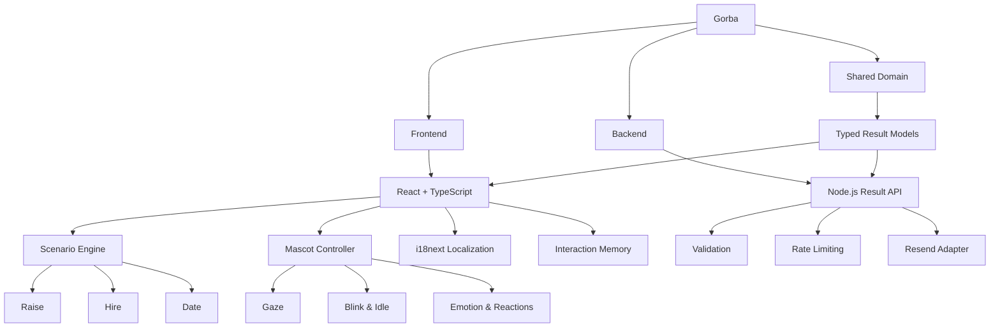

<div align="center">

<h1>

Gorba
</h1>

<p>
Interactive Character-Driven Decision Experience
</p>

</div>

<h1></h1>

A playful bilingual web experience built with **React + TypeScript** around a reactive kitten named **Gorba**.

Gorba turns simple questions into interactive conversations where the character watches, reacts, negotiates, gets emotional, and responds differently depending on the user's choices.

The project currently includes three experiences: **Ask for a Raise**, **Get Hired**, and **Plan a Date** — all powered by the same reusable interaction and mascot system.

<div align="center">

<br><br>


<br><br>


<br><br>

<a href="https://parsashafizade.github.io/Gorba/" target="_blank">
  
</a>

</div>


</div>

---

## Demo

Try the interactive experience:

<a href="https://parsashafizade.github.io/Gorba/" target="_blank">
  
</a>

The GitHub Pages demo runs the interactive frontend.

Optional result email notifications require the Node.js backend and are not available in the static GitHub Pages deployment.

---

## The Experience

Gorba is built around a simple idea:

**What if clicking “No” was not the end of the conversation?**

Instead of behaving like a traditional form, the interface reacts to the user's decisions.

Gorba can:

* React emotionally to Yes and No
* Answer the other person's responses
* Look toward different parts of the interface
* Blink and perform subtle idle movements
* Become increasingly persistent after repeated No responses
* Remember interactions while switching between scenarios
* Change reactions depending on previous choices
* Celebrate the final result with scenario-specific feedback

The goal is to transform a basic decision flow into a small character-driven product experience.

---

## Experiences

### 💸 Ask for a Raise

A playful salary negotiation where Gorba tries to convince the boss, reacts to rejection, negotiates the raise percentage, and works toward the final agreement.

### 💼 Get Hired

A fictional hiring flow where Gorba deals with recruiter objections, chooses a role and salary tier, and works toward getting the offer.

### ☕ Plan a Date

A lighthearted date invitation where Gorba reacts to hesitation, helps choose the activity, and schedules the final date and time.

Each experience follows its own dialogue and interaction rules while sharing the same underlying experience engine.

---

## Interactive Mascot

Gorba is not a single static image.

The mascot system contains multiple semantic visual states including:

* Center, left, right, up, and down gaze
* Diagonal gaze directions
* Half and full blink states
* Happy reactions
* Sad reactions
* Pleading reactions
* Angry reactions
* Excited reactions
* Playful idle movement
* Action poses

Character transitions are animated rather than replaced instantly, giving Gorba a more continuous and responsive personality.

<br>

<div align="center">


</div>

---

## Bilingual Experience

Gorba currently supports two languages:

* English
* Persian

The interface supports both **LTR** and **RTL** layouts.

Scenario copy is managed through `i18next`, while the selected language is preserved between visits.

---

## Architecture

The application separates the interactive frontend, optional result backend, and shared result models.



---

## Tech Stack

### Frontend

* React
* TypeScript
* Vite
* React Router
* Motion
* i18next
* CSS
* Vitest
* Testing Library

### Backend

* Node.js
* TypeScript
* Resend integration
* Runtime result validation
* Per-IP rate limiting
* Completion idempotency

### Shared

* Typed result schemas
* Shared result builders
* Scenario domain models

---

## Choosing Available Experiences

All three scenarios are enabled by default.

You can control which experiences are available using:

```dotenv
VITE_ENABLED_SCENARIOS=raise,hire,date
```

Examples:

```dotenv
# Raise only
VITE_ENABLED_SCENARIOS=raise

# Hire only
VITE_ENABLED_SCENARIOS=hire

# Date only
VITE_ENABLED_SCENARIOS=date

# Raise + Hire
VITE_ENABLED_SCENARIOS=raise,hire
```

Disabled scenarios are automatically removed from the selector.

---

## Getting Started

Requires **Node.js 20.11+**.

Clone the repository:

```bash
git clone https://github.com/parsashafizade/Gorba.git

cd Gorba
```

Install dependencies:

```bash
npm install
```

Create the environment file:

```bash
cp .env.example .env
```

Start the development environment:

```bash
npm run dev
```

Open:

```text
http://localhost:5173
```

The development command starts both the Vite frontend and the lightweight Node.js API.

---

## Production Build

Create the production build:

```bash
npm run build
```

Start the Node.js production server:

```bash
npm start
```

Run all project checks:

```bash
npm run check
```

This runs:

* Type checking
* Linting
* Tests
* Frontend build
* Backend build

---

## Email Result Notifications

Gorba can optionally send completed scenario results to the project owner.

The backend uses **Resend** through a server-side provider adapter.

Configure the following variables in `.env`:

```dotenv
EMAIL_NOTIFICATIONS_ENABLED=true
RESEND_API_KEY=re_your_api_key_here
EMAIL_FROM="Gorba <results@your-verified-domain.example>"
RESULT_EMAIL_TO=owner@example.com
```

Visitors are not asked to provide their name, email address, account, or login information.

Completed results are sent only to the address configured by the project owner.

> Never expose `RESEND_API_KEY` through a `VITE_*` variable or commit your `.env` file.

---

## Repository Structure

```text
Gorba/
│
├── frontend/
│   ├── src/
│   │   ├── app/
│   │   ├── components/
│   │   ├── config/
│   │   ├── features/
│   │   │   ├── experience/
│   │   │   └── mascot/
│   │   ├── localization/
│   │   └── styles/
│   │
│   └── ...
│
├── backend/
│   └── src/
│       ├── http/
│       └── mail/
│
├── shared/
│   └── results.ts
│
├── gorba/
│   ├── gaze/
│   ├── emotion/
│   ├── micro/
│   ├── idle/
│   └── action/
│
├── docs/
│
└── README.md
```

---

## Contributing

Contributions are welcome.

You can contribute by:

* Reporting bugs
* Suggesting new interactions
* Improving responsive behavior
* Adding new Gorba reactions
* Improving translations
* Creating new scenarios
* Submitting pull requests

---

## Future Improvements

* More interactive scenarios
* Additional Gorba emotion states
* More contextual dialogue variations
* New character animations
* Additional languages
* More customization options for clone owners
* Production-hosted result notification service

---

## Author

<table>
  <tr>
    <td>
      <a href="https://github.com/parsashafizade">
        
      </a>
    </td>
    <td>
      <strong>Parsa Shafizade</strong><br><br>
      <a href="https://github.com/parsashafizade">
        
      </a>
    </td>
  </tr>
</table>


---

<div align="center">

<a href="https://parsashafizade.github.io/Gorba/" target="_blank">
  
</a>

</div>
